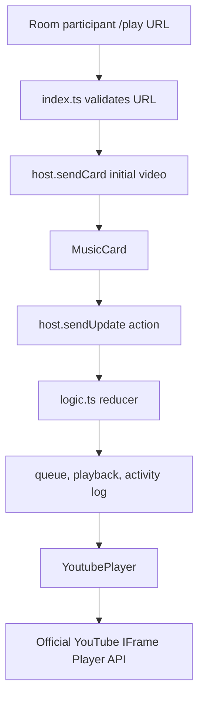

# YouTube Music MVP Design

**Spec:** `.specs/features/youtube-music-mvp/spec.md`
**Status:** Approved

---

## Architecture Overview

`/play` validates a YouTube URL and posts a plugin card containing one video identifier. The card's pure reducer folds persisted updates into queue, playback, and activity-log state. Each browser uses that state to control its own official IFrame player.



## Code Reuse Analysis

### Existing Components to Leverage

| Component | Location | How to Use |
| --- | --- | --- |
| Plugin registration | `plugins/steam-roulette/index.ts` | Register manifest, card, reducer, initial state, and slash command. |
| Pure state reducer pattern | `plugins/steam-roulette/logic.ts` | Validate peer-supplied payloads and return immutable state. |
| Card props and updates | `plugins/steam-roulette/SteamRouletteCard.svelte` | Receive `card`, `cardState`, `host`; send persisted updates via `host.sendUpdate`. |
| Semantic card styling | `plugins/steam-roulette/SteamRouletteCard.svelte` | Use existing Tailwind semantic tokens such as `bg-card`, `text-muted-foreground`, and `border-border`. |
| Plugin test layout | `plugins/steam-roulette/steam-roulette.test.ts` | Co-locate Vitest reducer tests with the plugin. |

### Integration Points

| System | Integration Method |
| --- | --- |
| awful.chat plugin host | `sendCard` creates a persisted session; `sendUpdate` persists collaboration actions. |
| Plugin replay state | `initialState` seeds the first video; `reduce` rebuilds state from ordered updates. |
| YouTube playback | A browser-local IFrame Player API instance loads the selected video and applies shared intent. |

## Components

### Queue reducer

- **Purpose**: Validate URLs and updates, then deterministically materialize queue, playback, and activity-log state.
- **Location**: `plugins/youtube-music/logic.ts`
- **Interfaces**:
  - `youtubeVideoId(input: string): string | null`
  - `initialState(cardData: unknown): MusicState`
  - `reduce(state, update, ctx): MusicState`
- **Dependencies**: `UpdateCtx` from the plugin host surface.
- **Reuses**: The Steam Roulette pure-reducer test pattern.

### Plugin definition

- **Purpose**: Publish metadata and create a first music card from `/play <YouTube URL>`.
- **Location**: `plugins/youtube-music/manifest.ts`, `plugins/youtube-music/index.ts`
- **Dependencies**: `definePlugin`, `MusicCard`, and queue reducer.
- **Reuses**: Built-in slash-command registration.

### YouTube player component

- **Purpose**: Load one visible official player and apply selected video, position, and play/pause intent locally.
- **Location**: `plugins/youtube-music/YoutubePlayer.svelte`
- **Interfaces**: Props `videoId`, `playing`, and `position`.
- **Dependencies**: YouTube IFrame Player API loaded once per browser.
- **Reuses**: Svelte 5 prop and lifecycle patterns.

### Music card component

- **Purpose**: Render themed queue controls, activity log, queue collapse state, and local playback controls.
- **Location**: `plugins/youtube-music/MusicCard.svelte`
- **Dependencies**: `HostApi`, `YoutubePlayer`, and reduced `MusicState`.
- **Reuses**: Existing plugin-card button and error-handling patterns.

## Data Models

```ts
interface Activity {
  senderName: string;
  action: "added" | "removed" | "skipped" | "played" | "paused" | "seeked";
  videoId: string | null;
}

interface MusicState {
  queue: string[];
  currentIndex: number | null;
  playing: boolean;
  position: number;
  activity: Activity[];
}
```

An update is one of: `{ action: "add", videoId }`, `{ action: "remove", index }`, `{ action: "skip" }`, `{ action: "play", position }`, `{ action: "pause", position }`, or `{ action: "seek", position }`. The reducer rejects malformed values before changing state or appending an activity entry.

## Error Handling Strategy

| Error Scenario | Handling | User Impact |
| --- | --- | --- |
| Unsupported URL | Reject locally before sending a card/update | Inline format message; no shared mutation. |
| Invalid received update | Reducer returns the prior state | No bogus queue or log entry. |
| IFrame API/player error | Preserve reduced state and show local error | User can retry locally; peers remain unaffected. |
| Autoplay blocked | Expose local enable-playback action | User explicitly starts their own player. |

## Risks & Concerns

| Concern | Location | Impact | Mitigation |
| --- | --- | --- | --- |
| The public host has no active-call participant list | `../awful.chat/frontend/src/lib/plugins/api.ts:36` | Call-only permissions cannot be enforced | Authorize every room participant in the MVP. |
| The host has no shared clock | `../awful.chat/frontend/src/lib/plugins/api.ts:36` | Clients cannot remain frame-accurate | Synchronize explicit selected-track and seek actions only. |
| YouTube requires a visible, unobscured player | YouTube required minimum functionality | CSS hiding would violate the integration constraints | Keep the player visible; collapse only surrounding queue details. |
| UI component tests are not configured in the external plugin pack | `../awful.chat/frontend/vitest.config.ts:10` | Browser-player interaction is not unit-tested | Unit-test reducer behavior; typecheck and perform two-browser UAT before release. |

## Tech Decisions

| Decision | Choice | Rationale |
| --- | --- | --- |
| YouTube integration | Official IFrame Player API | Supports local playback control without a Data API key. |
| Queue identity | Ordered video-ID array; duplicates allowed | Matches a request queue and keeps the reducer small. |
| Activity history | Derived from persisted actions | It replays with the same state and requires no separate storage. |
